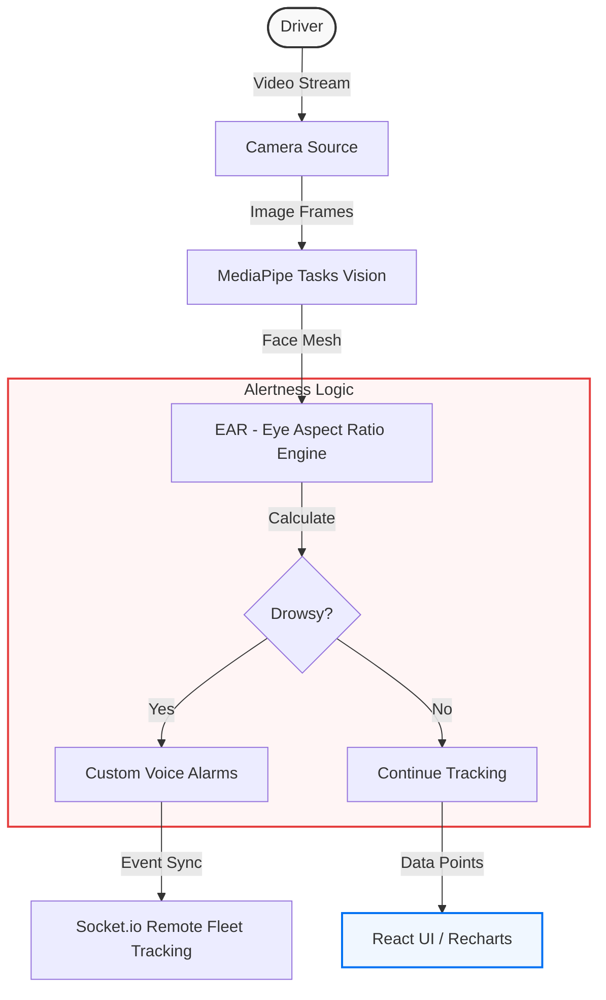

# 🚗 DriverGuard: AI-Powered Drowsiness Detection System

[](https://react.dev/)
[](https://mediapipe.dev/)
[](https://tailwindcss.com/)
[](https://opensource.org/licenses/MIT)

**DriverGuard** is a sophisticated, real-time safety application engineered to combat driver fatigue and prevent road accidents. Using cutting-edge computer vision, it monitors driver alertness levels and provides immediate, multi-sensory alerts when signs of drowsiness are detected.

---

## 🏗️ System Architecture

The system utilizes a high-frequency processing pipeline to ensure sub-second detection latency.



## 📂 Project Structure

```text
driver-drowsiness-system/
├── src/
│   ├── components/    # UI elements: Charts, Map, Alarms
│   ├── services/      # MediaPipe & Audio processing logic
│   ├── utils/         # EAR threshold calculators & translations
│   ├── App.jsx        # Core application wrapper
│   └── main.jsx       # Entry point
├── public/            # Static assets and alarm samples
├── index.html         # Main entry HTML
├── vite.config.js     # Build & Plugin configuration
└── package.json       # Project dependencies
```

## ✨ Key Features

- **👁️ Real-time Fatigue Analysis**: Leverages EAR (Eye Aspect Ratio) monitoring via MediaPipe Face Landmarker for millisecond-accurate tracking.
- **🎙️ Multi-lingual Voice Alerts**: Dashboard and safety alerts available in **English, Hindi, Marathi, and Hinglish**.
- **🔔 Personalized Alarms**: Record and use custom voices (family, friends) to wake up the driver more effectively.
- **📈 Alertness Analytics**: Visualizes fatigue trends over time using interactive **Recharts**.
- **📍 Fleet Monitoring**: Integrated **Leaflet Maps** and **Socket.io** for remote tracking of driver status.
- **✨ Glass-morphism Design**: A premium, modern UI designed for high visibility in vehicle environments.

## 🛠️ Tech Stack

- **Framework**: [React 19](https://react.dev/)
- **Vision Engine**: [MediaPipe Tasks Vision](https://developers.google.com/mediapipe/solutions/vision/face_landmarker)
- **Styling**: [Tailwind CSS 4](https://tailwindcss.com/)
- **Data Visualization**: [Recharts](https://recharts.org/)
- **Mapping**: [Leaflet JS](https://leafletjs.com/)
- **Real-time Sync**: [Socket.io](https://socket.io/)

## 🚀 Getting Started

Follow these steps to set up the system locally:

1. **Clone the repository**
   ```bash
   git clone https://github.com/kartikshete/driver-drowsiness-system.git
   ```
2. **Install dependencies**
   ```bash
   npm install
   ```
3. **Start the development server**
   ```bash
   npm run dev
   ```
4. **Permissions**: Ensure you grant **Camera Access** in your browser for the detection engine to function.

## 👨‍💻 Author

**Kartik Shete**
- GitHub: [@kartikshete](https://github.com/kartikshete)

---
*Dedicated to making roads safer through the power of AI.*

<!-- Safety log 12 -->
<!-- Safety log 16 -->
<!-- Safety log 24 -->